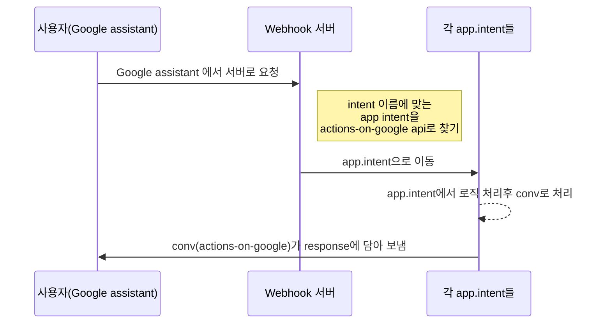

# Google Assistant & Dialogflow 챗봇 for GCP Cloud Functions용 샘플코드

## 개요

* [현재 라이브 버전 KO ](https://assistant.google.com/services/a/uid/0000000b9551ab62?hl=ko)
* [현재 라이브 버전 JA ](https://assistant.google.com/services/a/uid/0000000b9551ab62?hl=ja)
* [현재 라이브 버전 EN ](https://assistant.google.com/services/a/uid/0000000b9551ab62?hl=en)

"로또마스터한테 말하기" 로 인보케이션 가능.
언어는 한국어 입니다.
DialogFlow와 **Google cloud functions**기능으로 **nodeJS**를 이용해서 만들었습니다.
api버전은 V1이었지만, 12월 15일을 기점으로 V2으로 제작 되었습니다.
앱은 기본적으로 로또번호를 생성해 주며 영어와 일본어 버전은 원샷 어플로 실행이 됩니다.
한국어 앱은 번호 생성후에 사용자의 명령을 기다립니다.
request npm으로 나눔로또 api를 이용, 현재회차와 지정한 회차에 따른 로또번호를 받아옵니다.

본 페이지의 샘플코드는 Google GCP의 [Cloud Functions](https://cloud.google.com/functions/)에 올릴 수 있게 만들어진 샘플코드 입니다. 여기서는 로또 당첨 번호를 조회하는 챗봇으로 설명을 합니다. 설명하는 코드를 위해서 만든 챗봇이 **로또번호 조회**인 이유는 다음과 같습니다.

물론 수학 잘하는 사람은 로또를 하지 않습니다.

* 숫자라는 데이터를 이용한다는 점에서 정형화.
* **API**가 공개돼 있고 특별한 인증키가 필요하지 않음.
* 실생활과 밀접하게 사용 되고 있고, 누구나 알고 있는 서비스. (미성년자는 안되지만...)

이 서비스에서는 **로또번호의 생성**과 **현재 당첨번호**, **이전 회차의 당첨번호** 그리고 3가지 기능을 만들게 됩니다.

챗봇을 만드는 사람이 최대한 이해하기 쉽게 쓰고자 했지만 혹시 어려운 점이 있으면 E-mail을 보내주시면 되겠습니다.

## 특징

이 샘플코드의 특징은 다음과 같습니다.

 1. 이해하기 쉽게 만들었습니다.

남이 짠 코드도 힘든데 새로운 기능도 만들어야 한다면...

일반적인 샘플 코드의 경우 class 를 쓴다던가 하는 고급기술을 쓰거나 아마존 **EC2**(구글에서는 앱엔진)을 써서 파일을 여러개로 분리하는 방식을 사용하고 있습니다. 이 방식이 맞긴 맞지만, 이해하기 어려운 내용이 있습니다. 특히 **기초를 이해해야 다음 단계로 이해**를 하는데, 처음 챗봇을 제작하는 입장에서는 이런점도 어려운 부분입니다. 이를 해결하고자 **한 페이지**로 간단하게 만들었습니다.

 2. 서버 비용 문제 해결

비용의 차이가 느껴지십니까?

개인개발자의 비용을 내고 싶지 않은게 현실입니다. 때문에  [Cloud Functions](https://cloud.google.com/functions/)이나 [Lamda](https://aws.amazon.com/ko/lambda/features/)를 사용하여 올릴 수 있도록 만들게 되었습니다. 저 또한 [Cloud Functions](https://cloud.google.com/functions/)을 자주 사용하는 입장입니다.

## Dialogflow설정하기

우선 **DialogFlow**으로 가서 제작을 해봅시다. **DialogFlow**은
다음과 같은 형태 중 **대화 인텐트** 인터페이스를 설계하는 곳입니다.

DialogFlow

이런 형태로 **Dialogflow DashBoard**가 보일 것입니다. 이제 하나씩 만들어 봅시다.

### 1. Dialogflow 만들기 & 서버 설정

우선 플레이 킷을 만듭니다. [Dialogflow console](console.dialogflow.com/api-client/)에서 계정을 만들고 새로운 이름을 만듭니다.

우선 **Webhook**에 서버 주소를 입력합니다. **GCP**의 **Cloud functions**의 소스 주소를 입력합니다. 이로서 서버 연동 주소를 입력을 완료했습니다.

> 내부 Inline Editor을 사용해도 됩니다만, request모듈같은 경우 동작하지 않는 경우가 있어서 GCP의 Cloud functions를 사용하게 되었습니다.
>https://cloud.google.com/functions/ 로 가시면 이용이 가능합니다. 1년동안 무료고 트래픽 가격도 쌉니다. 그리고 챗봇이 어시스턴트 심사 통과시, redeem code를 주기 때문에 돈이 들 일이 거의 없습니다.

### 2. Intent 설정

다 완성된 모습입니다. 이렇게 입력을 하게 됩니다.

Training phrases는 사용자의 발화를 입력하는 부분입니다. **최소 10개 이상은 넣는게 안전**하다고 봅니다 만, 저 같은 경우는 20개 정도를 넣습니다. 최대한 머리를 짜내어(..) 넣어보도록 합시다.

Training phrases 이름은 Intent.name 형식으로 입력을 하였습니다. 여기서는

* intent.beforelotto
* intent.lottogenerator
* input.noinput
* intent.exit
* intent.support
* intent.help
* intent.nowlotto

총 7가지 가지를 입력 했으며  **Webhook**연동을 통해서 전부 구현 하였습니다. 도움말 같이 가벼운 기능들은 **Dialogflow**상에서 구현도 가능하지만 개발자의 귀찮음으로 인해서 그냥(..) 전부 **Webhook**에서 처리를 하게 되었습니다.

 1. intent.beforelotto

 특정 회차를 말하면 API를 이용하여 당첨번호와 1등 상금액수 등을 조회하는 기능입니다.

사진과 같은 형태로 입력을 하였습니다. 각 숫자에는 **sys.number**라는 **시스템 Entity**를 사용하였습니다. **Dialogflow**에서 **미리 만들어진 Entity**로 사용자가 말한 숫자를 인식하여 **Parameter**로 이용합니다. 자동으로 입력이 되지만, 초기에는 숫자를 드래그 해서 Entity적용을 합니다.

우선 드래그를 하면 사진처럼 뭔가 뜹니다.
만약 **Custom entity**가 있다면 만든 **Custom entity**이름을 지정하면 되지만 그렇지 않고 일반적인 값이라면 **Dialogflow**가 만든 기본 Entity가 가능합니다. 리스트는 [레서런스 문서 링크](https://dialogflow.com/docs/reference/system-entities#date-ko-v2)에 있습니다.

여기서는 **숫자를 쓰기 때문**에 따로 Entity를 만들 필요가 없고 **시스템 Entity**를 쓰는 겁니다.

지정을 하면 사진과 같이 됩니다. **Parameter**의 **name**은 **number**이며 Entity는 sys.number이네요. 이후 **Webhook**에서 쓰이는 **Parameter**의 이름은 **number**가 되는 것입니다.

나머지  **Training phrases**에 입력을 하면 자동으로 Entity가 입력되기 때문에 하나하나 드래그를 하지 않아도 됩니다. 물론 수동으로 해야 할때도 있기 때문에 방심은 금물!

2. intent.lottogenerator

6개의 로또번호의 생성을 인식하는 **Training phrases**입니다. 여기서는 **Entity**를 쓰지 않습니다. 단지 **Webhook**를 건드리는 용도로 인식만 해주면 되기 때문입니다.

 3. intent.nowlotto

최근의 로또 당첨번호와 1등상 액수 등을 인식하는 **Intent**입니다.

nowLotto Intent는 Entity가 필요 없기 때문에 **Training phrases**를 입력하고 저장 하면 끝납니다.

4. intent.noinput

**Google Home**에서만 작동하는 기능입니다. **Event**기능을 이용하는 것으로 아래의 텍스트를 이벤트 안에 넣으면 됩니다.
> actions_intent_NO_INPUT

레퍼런스 문서는 [Aog](https://developers.google.com/actions/assistant/reprompts) 입니다. 영어로 되어 있어서 난감할수 있지만 저런 방식으로 구현을 합니다.
**Training phrases**는 필요가 없습니다. 무음시 구글 홈이 동작하는 기능이기에 특별한 발화가 필요 없기 때문입니다.

5. 사용자 경험을 위한 도움말 기능

사용자 경험을 위해서 어떻게 사용하는지 모르는 사람들을 위해서 도움말 기능이 있으면 좋습니다. 저는 주로 도움말이나 메뉴얼로 어떤 기능을 하는지 넣습니다. 그리고 지원되는 커멘드 소개를 따로 분리를 하였습니다.

6.  Webhook 활성화

**Webhook**기능을 사용한다면 Intent의 하단에 있는 사진의 기능을 활성화 해야 합니다. 이를 활성화 하지 않으면

Webhook가 연결되지 않았는데 기능을 실행하려고 하면 이런 에러가 납니다.

> MalformedResponseFailed to parse Dialogflow response into AppResponse because of empty speech response.

## Webhook 로직 구조

 1. 사용자가 말한 내용을 **DialogFlow**이 처리를 하여 적절한 Intent를 찾습니다. Intent는 연결된 **Training phrases**를 찾고, 설정된 방식으로 **Webhook** 서버에 **Request서버에 JSON**을 보냅니다.

 2. 서버에는 들어온 **JSON은** **actions-on-google** 모듈이 받아서 사용합니다.  받은 모듈이 intent의 **이름**으로 app.intent를 찾습니다.

 4. 찾은 이름의 데이터를 처리합니다. 만약 **Parameter**를 사용한다면 *conv.parameters['파라메터이름'];* 을 사용하여 받습니다.

 5. 처리된 값을 **conv**에 넣어서 처리합니다. 구글 어시스턴트는 **actions-on-google** npm이 있기 때문에 JSON을 일일히 만들지 않아도 됩니다. 자동으로 Response가 되어 종료를 합니다.

> actions-on-google은 npm으로 설치가 가능하며, 이 모듈이 있기 때문에 JSON을 일일히 만들어야 하는 수고를 덜 수 있습니다.

> actions-on-google의 경우 *V1*과 *V2*가 문법이 다릅니다. 여기서는 V2최신 문법을 사용합니다. (V1은 October 23rd, 2019 deprecated 되었습니다. )

> 이 방식의 경우 intent의 '이름'을 사용합니다. Action의 이름을 사용하는 방법도 있긴 한데, 그냥 이름을 사용하시기를 권장합니다. (레퍼런스가 그러고 있음)

## 코드 설명

이제부터 Webhook를 해야 합니다

코드의 설명에 있어서 로또번호를 생성하는 부분을 예시로 설명하겠습니다.

###  actions-on-google

앞서 설명을 했다시피 **Google assistant**는  **actions-on-google**을 사용합니다. 때문에 **JSON**을 파싱하는 일을 할 필요가 없습니다. 자바를 이용해서 구현한다면 해야겠지만, 여기서는 nodeJS를 사용합니다. 때문에 코드가 이걸로 끝입니다.

    exports.lottonumbergenerator = functions.https.onRequest(app);

정말 간단하죠?

### app.intent

    app.intent(FALLBACK, (conv) => {
	//로직 내용
	});

**DialogFlow**에서 설정한 **intent**의 이름을 찾아서 도착을 하면 *로직이 실행*이 됩니다. 실행시 로직을 **function으로 분리 구현하는 방법**도 있으며, 그냥 안에 냅다 쓰는 방법도 있습니다. 여기서는 따로 분리를 하였습니다.

### function설명

로직 내용이 여러가지가 있지만 여기서는 간단하게 Parameter가 올때, 그리고 오지 않을 때인 3개의 로직을 기준으로 설명하겠습니다.

*  **intent.nowlotto**
현재 회차의 로또번호와 상금을 조회합니다. Request시 **파라메터는 없으나** Response시 **데이터를 보내는 형태**입니다. **request**와 **cheerio**를 이용하여 웹 페이지에 대한 크롤링을 사용하였습니다.
>크롤링: 웹 페이지를 그대로 가져와서 거기서 데이터를 추출해 내는 행위

*  **intent.beforelotto**
회차별 로또번호와 상금을 조회합니다. Request시 **파라메터에 사용자가 말한 회차**(숫자)를 가져오며, Response시 **만들어진 텍스트를 보내는 형태**입니다. **request**를 이용하여 **JSON**을 요청, 파싱하여 데이터 얻습니다.

*  **intent.lottogenerator**
**Request시 파라메터는 없으며 Response시 텍스트를 출력**하여 데이터를 보내는 형태입니다. 내부 로직을 통해서 랜덤한 6개의 로또번호를 생성합니다.

> 기존에는 로또 API에서 현재회차 조회가 가능했지만, 6개월 전쯤부터 회차를 지정하지 않으면 에러가 나왔습니다. 그래서 웹 크롤링을 통해서 구현을 하게 되었습니다. 이런류의 로직은 request npm module을 통해서 구현할수 있으며, 이는 [레퍼런스 문서](https://www.npmjs.com/package/request)를 참조하시기 바랍니다.

### intent.nowlotto (현재회차 조회)

> request와 크롤링 부분은 설명을 생략합니다.

    //NOWLOTTO_INTENT
		app.intent(NOWLOTTO_INTENT, (conv) => {

		  return asyncTask(0)
		    .then(function(item) {
		      //로그 확인용
		      console.log("result : " + JSON.stringify(item));
		      lottoResultData(conv, item);
		    });
		}); //NOWLOTTO_INTENT

이름과 같은 **app.intent**가 동작하면 request모듈이 조회를 시작합니다. **로직이 선택회차 조회와 같으므로** function을 분리하였기에 **conv**와  **조회된 값 item**을 넘겨줍니다.

아래는 function lottoResultData() 입니다.

	let displayText ='';
	let speechText = '';

	if (item.returnValue == "fail") { // 서버접속 실패 혹은 200에러 등
    displayText = "아직 진행되지 않은 로또회차이거나 서버에러 등으로 서비스를 제공할 수 없었습니다. 다른 회차를 말해주세요.  ";
    speechText = displayText;
	} else { // 서버가 움직인다면
    let firstWinAmount = item.firstWinamnt; // 1등상 액수
    let firstPrizeHuman = item.firstPrzwnerCo; // 총 인원

    let rawDate = item.drwNoDate; // 당첨날짜

    //날짜 구하는 부분
    var dt = new Date(rawDate);
    let month = dt.getMonth() + 1;
    let dateText = dt.getFullYear() + '년 ' + month + '월 ' + dt.getDate() + '일';
    let kai = item.drwNo; // 회차

    // 번호들, 보너스번호
    let number1 = item.drwtNo1;
    let number2 = item.drwtNo2;
    let number3 = item.drwtNo3;
    let number4 = item.drwtNo4;
    let number5 = item.drwtNo5;
    let number6 = item.drwtNo6;
    let bnusNo = item.bnusNo;
    let firstHowTo = '';

    let resultFirstPrize = numberWithCommas(firstWinAmount);

    if (item.firstHowTo != undefined) {
      firstHowTo = item.firstHowTo
      firstPrizeHuman = firstHowTo
    }

    displayText = dateText + "의 " + kai + " 회차 로또번호는 " +
      number1 +
      " " +
      number2 +
      " " +
      number3 +
      " " +
      number4 +
      " " +
      number5 +
      " " +
      number6 +
      " 보너스 번호는 " +
      bnusNo +
      " " +
      "입니다. 1등상은 " + firstPrizeHuman + "명이 당첨되었으며 액수는 1인당 " + resultFirstPrize + "원 입니다.";

    speechText = "<speak>" + dateText + "의 " + kai + "회차 로또번호는 " +
      '<speak> <say-as interpret-as="cardinal">' + number1 +
      "</say-as></speak> " +
      '<speak> <say-as interpret-as="cardinal">' + number2 +
      "</say-as></speak> " +
      '<speak> <say-as interpret-as="cardinal">' + number3 +
      "</say-as></speak> " +
      '<speak> <say-as interpret-as="cardinal">' + number4 +
      "</say-as></speak> " +
      '<speak> <say-as interpret-as="cardinal">' + number5 +
      "</say-as></speak> " +
      '<speak> <say-as interpret-as="cardinal">' + number6 +
      "</say-as></speak> " +
      " 보너스 번호는 " +
      bnusNo + "입니다. 1등상은 " + firstPrizeHuman + "명이 당첨되었으며 액수는 1인당 " + firstWinAmount + "원 입니다. </speak>";

	  }

	  //ask
	  conv.ask(new SimpleResponse({
    speech: speechText,
    text: displayText,
	  }));
	  conv.ask(new Suggestions(suggestionList));
	  conv.ask(new BasicCard({
    text: '',
    subtitle: '',
    title: '',
    image: new Image({
      url: 'https://storage.googleapis.com/finalrussianroulette.appspot.com/lottoImage/lottoNow.jpg',
      alt: '이미지',
    }),
	  }));

로직 처리후 **conv.ask**에 넣어서 텍스트를 보냅니다. 여기서는 이미지와 선택 칩 그리고 ssml을 분리했기에 복잡하게 보이는 코드가 되었습니다. 정말 간단하게 텍스트만 보내고자 한다면 다음과 같이 처리가 가능합니다.

    conv.ask('여기에 말할 내용을 적으시면 됩니다.')

Chip은 하단에 나오는 기능입니다. 이미지와 같이 제안을 해주는 기능으로 사용자경험을 높이는 가장 쉽게 구현할 수 있는 기능입니다. 이외에도 리스트나 여러 선택지가 있습니다. Array를 넣어 만들수 있으며 8개까지 가능합니다. 즉 Array상으로는 0부터 7가 되겠죠?

    conv.ask(new Suggestions(['메뉴얼','이번주 로또번호','384회차 로또번호','잭필드']));

여기서는 [Basic card](https://developers.google.com/actions/assistant/responses#basic_card)형태로 구현해서 하단에 더 추가가 되었습니다.

    conv.ask(new BasicCard({
    text: '',
    subtitle: '',
    title: '',
    image: new Image({
      url: '이미지링크',
      alt: '이미지 텍스트',
    }),
	  }));

Action on google 레퍼런스를 보시면 [다양한 응답방법](https://developers.google.com/actions/assistant/responses#simple_responses)이 있으니 이를 참조하시면 됩니다.

> Media response 사용시에는 chip을 붙혀주시면 됩니다. 안그러면 오류가 나더군요.

### intent.beforelotto (특정회차 조회)

> request의 api요청 부분은 설명을 생략합니다.

	  app.intent(BEFORELOTTO_INTENT, (conv) => {
	  console.log(BEFORELOTTO_INTENT)
	  conv.data.fallbackCount = 0;

	  let getNum = conv.parameters['number'];
	  if (getNum == undefined) {
	    getNum = 0
	  }
		  //request
	  return asyncTask(getNum)
    .then(function(item) {
      lottoResultData(conv, item);

    });

	}); //BEFORELOTTO_INTENT

특정회차를 조회할때 **number** 라는 이름의 **parameter**을 만들었습니다. 이 **parameter**를 받기 위해서 이 코드를 씁니다. [레퍼선스](https://developers.google.com/actions/dialogflow/fulfillment)에도 나와았습니다.

    let getNum = conv.parameters['number'];

이를 통해서 숫자를 얻고 이를 **request**모듈로 보내어 **API**와 접속을 합니다. **JSON**을 받아오게 되고 **conv**와 결과인 **item**을 *공통 로직 처리 function*인 **lottoResultData**로 보내게 됩니다.

이후 로직은 현재회차 조회와 동일합니다. ~~어때요 참 쉽죠?~~

>  if (getNum == undefined)  이 처리를 한 이유는 만약에 에러가 날 수 있는 가능성을 없에기 위해서 이렇게 했습니다. 사용자 경험상 에러보다는 현재회차를 알려주는게 더 낫다고 판단했기 때문입니다.

> 아직 진행되지 않은 로또회차 이거나 서버에러 등으로 서비스를 제공할 수 없었습니다. 다른 회차를 말해주세요.

### intent.lottogenerator (로또번호 생성)

    app.intent(LOTTOGENERATOR_INTENT, (conv) => {
	  console.log("WELCOME_INTENT");
	  conv.data.fallbackCount = 0;
	  lottoNumberGenerator(conv, conv.user.locale);

	}); //

이 부분도 **lottoNumberGenerator function**으로 분리가 되어 있습니다. 이유는 사용자가 그냥 *안녕*같은 **의미없는 말**을 해도 Welcome intent로 동작하게 하기 위해서 동일한 기능을 넣어주었기 때문입니다. 이 역시 **사용자 경험**상의 이유로, 챗봇은 사용자 경험을 많이 생각하고 만들어야 합니다. ~~(덕분에 가상화폐 챗봇 만들때 잡코인 인식이 꽤나 고생합니다. 인식이 애매한게 많아서)~~

**conv.user.locale**은 언어설정 값을 얻을 수 있습니다. 한국의 경우 ko-KR형태이며 이 부분은 공식 문서인[ Language and Locale Support
](https://developers.google.com/actions/localization/languages-locales)에서 확인하실 수 있습니다.

	if (jsonLang == "ko-KR") {
    //ask
    conv.ask(new SimpleResponse({
      speech: speechText,
      text: displayText,
    }));
    conv.ask(new Suggestions(suggestionList));
    conv.ask(new BasicCard({
      text: '',
      subtitle: '',
      title: sayTitle,
      image: new Image({
        url: sayImage,
        alt: '이미지',
      }),
    }));

	  } else {
    //ask
    conv.close(new SimpleResponse({
      speech: speechText,
      text: displayText,
    }));
	  }

이 부분은 다국어 처리가 되어 있는 부분입니다. 로또마스터는 **3개국어**인 한국어, 일본어, 영어를 지원하고 있으며 **영어**와 **일본어**는 **원샷**으로 실행후 번호만 생성해 주고 끝납니다. 때문에

    conv.close('')

형태로 쓰게 된 것입니다. **ask**가 아닌 **close**를 붙이면 앱이 종료됩니다.

## 자 그럼 실제로 동작하는 지 살펴볼까요?

미리 시뮬레이션을 통해서 테스트를 할 수 있습니다. 또한 **구글 홈**이 없어도 **개발계정이 연동**된 안드로이드 5.0 이상인 폰으로 테스트가 가능합니다.

테스트로 브라우져 내 시물레이션이 가능합니다

잘 됩니다. :)

시뮬레이션으로 가는 과정을 건너뛰었는데 바로 아래에서 설명하겠습니다.

## 등록

1. Play 빌드 생성

우선 **integrations**메뉴로 가서 큰 **integration setting**을 클릭합니다.

그러면 이 화면이 뜨는데 위에 설정된 값을 입력해 줍니다. 추가를 하는 것은 [implicit invocation](https://developers.google.com/actions/discovery/implicit)을 설정하는 부분으로서, 단순히 "로또마스터한테 말하기"같은 기능실행이 아닌 **"로또마스터 한테 이번주 로또번호 조회해줘"**와 기능을 직접적으로 선택 지정하여 동작하는 **invocation**입니다. 바로 기능을 다이렉트로 동작한다는 점에서 빠르게 실행할 수 있습니다.

우선 이름을 지정합니다. 이름과 발음명은 동일하게 설정을 해줘야 하는데, 저는 느낌표를 넣었습니다. 이는 display상으로는 가능하지만 **느낌표는 발음이 불가능**하기 때문에 **modify pronounce기능을 통해서 느낌표를 제거**하였습니다.

보통은 그냥 일반적인 Invocation name을 설정하시면 됩니다.

시뮬레이션으로 넘어가면 이런 화면이 나옵니다. 스타트 세팅을 클릭하죠

버전을 고릅니다. Draft version을 선택합니다.

그리고 나서 언어를 선택하면 활성화 됩니다.

그리고 정상적으로 작동이 되는 모습을 확인할 수 있습니다.

2. Play 등록하기

Directory information으로 갑니다.
여기가 챗봇의 메타데이터를 등록하는 부분입니다.
사용자들이 이용할때 도움이 될 만한 정보나, 설명, 그리고 이미지 등등을 등록할 수 있습니다.

이미지의 경우 빅사이즈는 최소 크기가 1920 x 1080이며, 아이콘은 192 x 192입니다. 이보다 작으면 에러를 뿜으며 더 큰 이미지를 쓰라고 하네요.

Policy 주소를 넣는 부분입니다. 저는 [사이트
](http://stratos.dothome.co.kr/index.html#policy)를 만들어서 씁니다만 Google docs를 써서 공유하기로 하셔도 되고 google site기능을 이용해도 됩니다. 어떤 경우는 Google PPT 공유하기로 한 경우도 봤습니다. ~~벌칙게임 챗봇이었던가~~

**카테고리**설정을 하고 테스트 하는 분에게 내용을 적습니다. 보통은 테스트 지시사항을 적을 필요는 없지만, 저는 가끔 **짤방주소**을 보냅니다. 봤는지 안봤는지는 모르지만...

아, **Oauth2 로그인**을 이용한 경우는 테스트용 **아이디**와 **암호**를 보냅니다. 안 그랬다가 **deny**를 한번 먹은적이 있네요.

이렇게 해서 설명을 완성하면, Release에서 deploy를 해주면 됩니다.
심사가 통과되면 메일이 올거고, deny를 받으면 에러사항이 적혀서 옵니다.

## 이 샘플코드에 대해서 궁금한 점이 있으신가요?

이메일은 언제나 환영합니다. 어렵지만 않은 내용이면...

언제든지 **Dev.LunaStratos@gmail** 으로 이메일을 보내주시면 됩니다.
